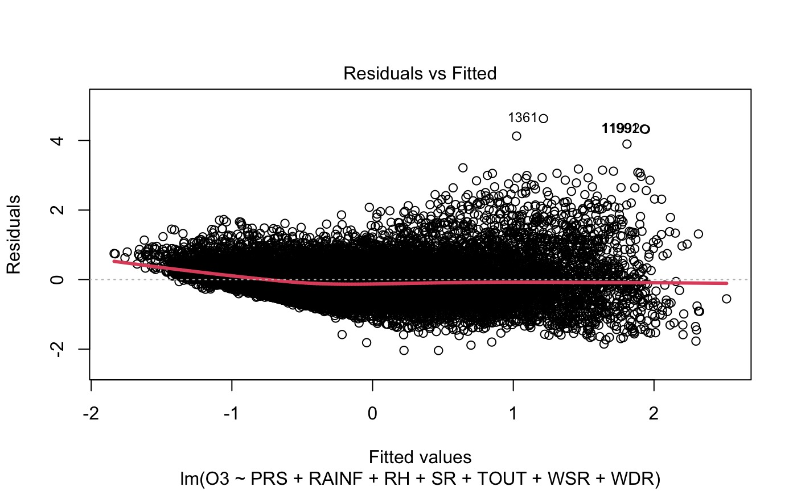
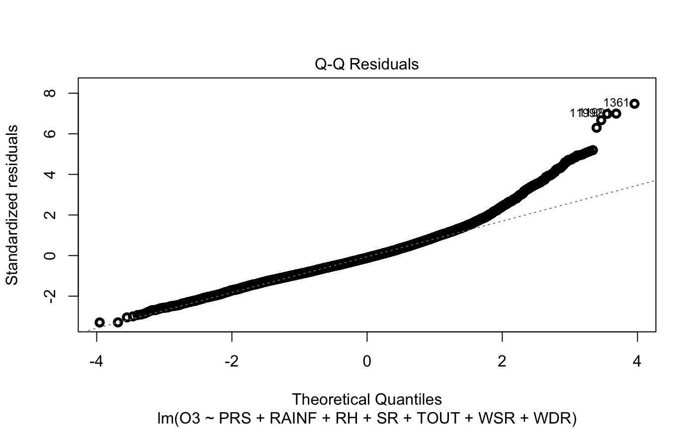
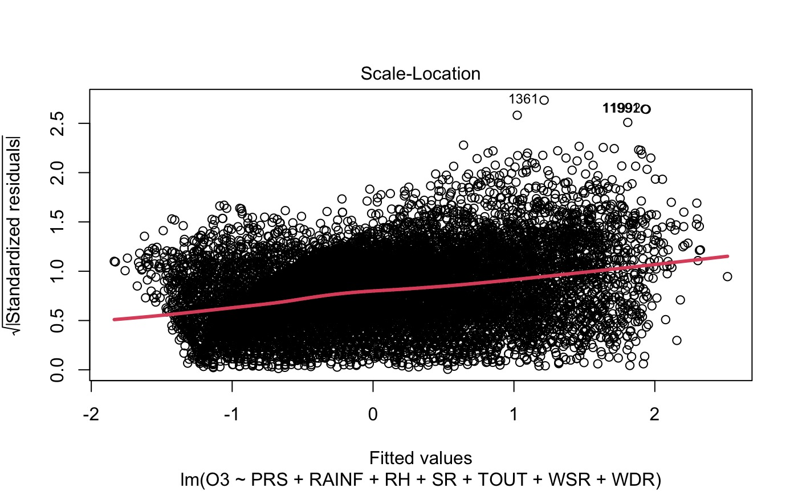
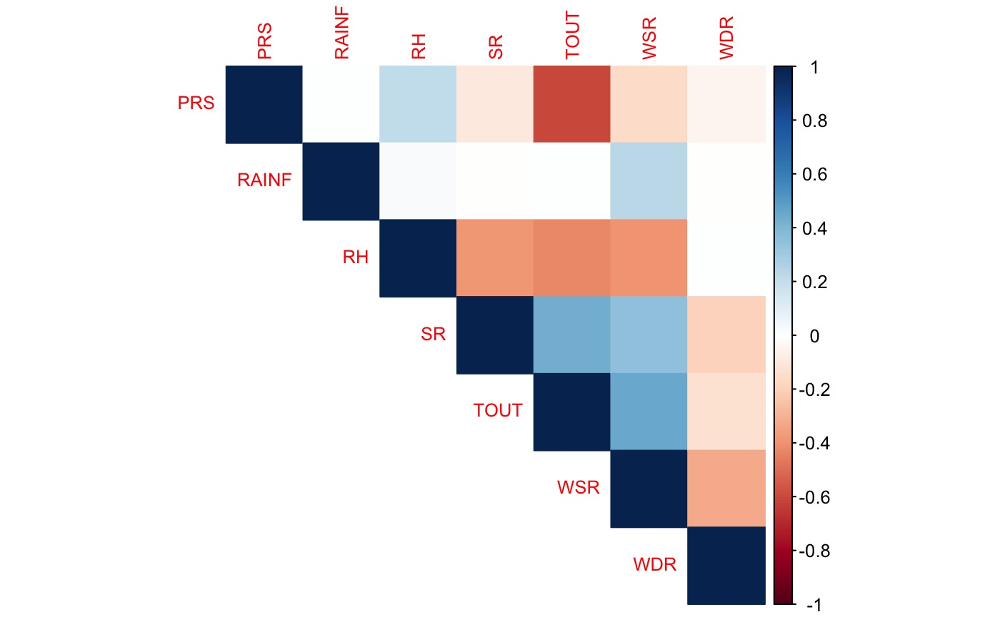
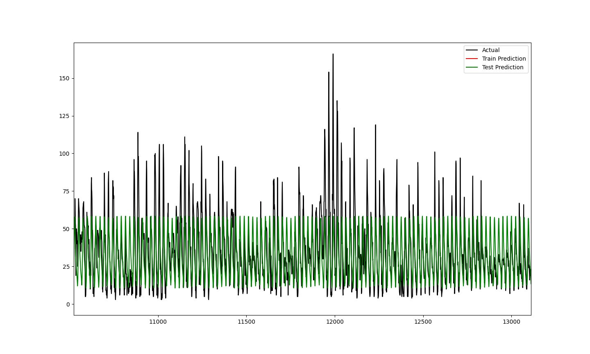
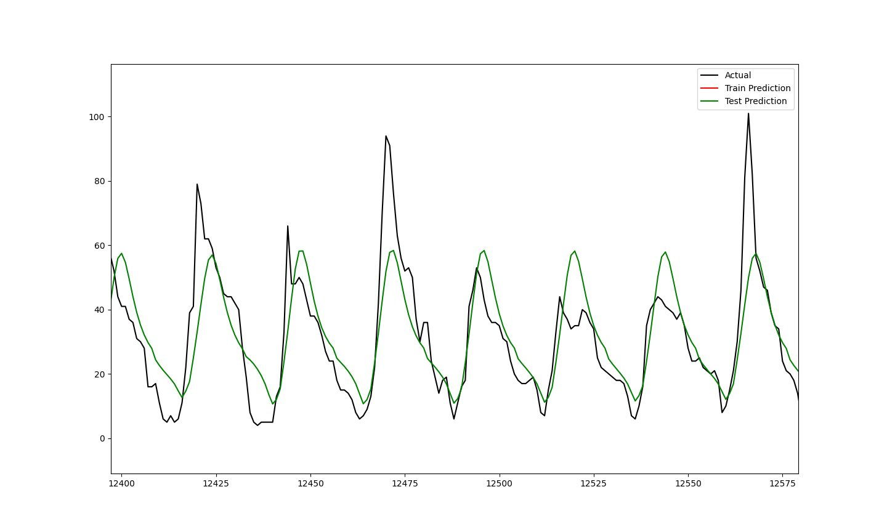
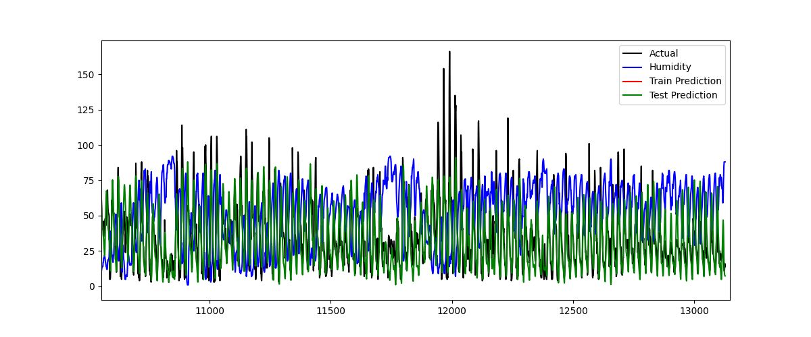
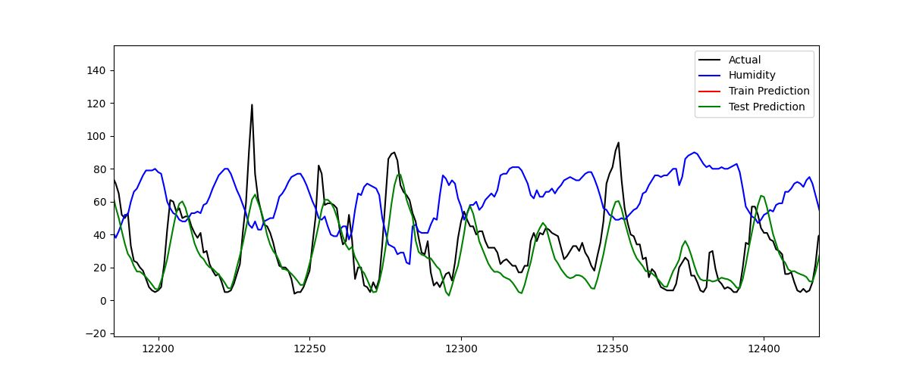
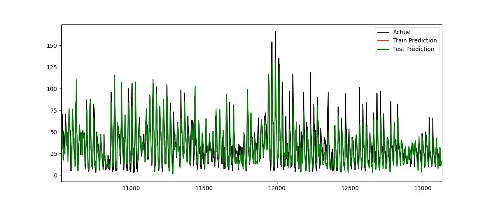
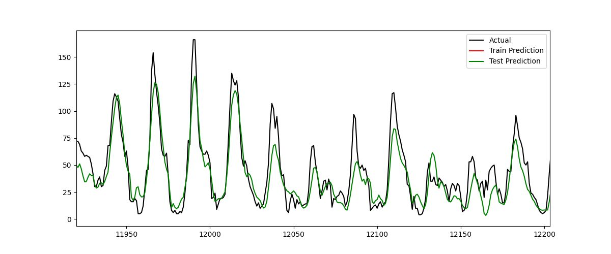

A01571511 - Alberto Palomino Carvajal 
A01612614 - Carlos Viramontes Espinosa 
A01571619 - Carlos Cuéllar Solís
A01571679 - Luis Javier Jacobo Morimoto

# Etapa 4. Conociendo el negocio

### Resumen

Nuestro proyecto llamado "Modelación del Comportamiento de Contaminantes en base a Factores Meteorológicos en Monterrye y su Área Metropolitana" fue desarrollado gracias a información dada por el Sistema Integral de Monitoreo Ambiental (SIMA), quienes proporcionaron datos confiables que permiten realizar estudios en la calidad del aire a fin de apoyar la toma de decisiones ambientales. Dentro del proyecto se busca analizar y predecir el comportamiento de contaminantes atmosféricos, específicamente ozono (O3) a partir de variables meteorológicas.

Este proyecto se centra en estudiar los valores de variables asociadas con contaminantes atmosféricos y relacionarlos con variables meteorológicas como temperatura, humedad, radiación solar, precipitación, presión atmosférica, y velocidad y dirección del viento. Se toman como referencia los años 2024 y 2025, evitando el sesgo de la pandemia, y se analizan dos zonas contrastantes en densidad poblacional, siendo el centro (Monterrey) y el norte (Escobedo).

La metodología está conformada por:

Preparación de los datos: limpieza, corrección de inconsistencias en formatos, imputación de valores faltantes mediante modelos de imputación, y escalamiento de variables para facilitar la interpretación de éstas.

Modelación estadística: uso de regresión lineal multivariada y métodos "Forward Selection" y "Backward Elimination" para la selección de variables independientes relevantes, y revisión de supuestos estadísticos para la variable O3.

Modelación con redes neuronales: uso de redes neuronales de arquitectura LSTM de estructura sencilla de modificar para generar predicciones de la variable O3 con la posibilidad de expandir el análisis al resto de contaminantes.

Dentro de los resultados se enseña como la regresión lineal, a pesar de utilizar datos que no son necesariamente normales, permitió explorar tendencias entre contaminantes y factores meteorológicos que a su vez guiaron la creación de redes neuronales específicas utilizando las variables más relevantes, como fue RH (humedad). También se enseña cómo las redes neuronales LSTM lograron capturar patrones presentados en el comportamiento de la contaminante con cierta precisión para cortos lapsos de tiempo, pero presentando dificultades en lapsos más prolongados.

En conclusión, el análisis elaborado confirma que el contaminante atmosférico de ozono puede modelarse en función a los factores meteorológicos mediante la implementación de redes neuronales de arquitectura LSTM, que ofrecen un rendimiento deseable en predicciones a corto plazo, mientras que los modelos elaborados de regresión lineal aportan una visión exploratoria de los datos. Estos modelos y estudio representan una herramienta valiosa para realizar preparaciones para episodios críticos de contaminación, a fin de organizar medidas preventivas de salud pública.

### Introducción y justificación

El proyecto “Modelación del Comportamiento de Contaminantes en base a Factores Meteorológicos en Monterrey y su Área Metropolitana” tiene como socio formador el Sistema Integral de Monitoreo Ambiental (SIMA).

De acuerdo con la Secretaría de Medio Ambiente de Nuevo León (2024), el Sistema Integral de Monitoreo Ambiental (SIMA), inaugurado el 20 de noviembre de 1992, ha pasado de cinco estaciones iniciales a 15 fijas en 11 municipios y dos móviles; operado por ingenieros especializados, garantiza datos confiables, permite anticipar episodios de contaminación, alertar a la población y evaluar políticas ambientales, reafirmando el compromiso de proteger el medio ambiente y la salud pública, promoviendo un Nuevo León con aire más limpio y saludable [1].

El proyecto consiste en, mediante el uso de técnicas estadísticas, generar modelos de regresión lineal y redes neuronales que sean capaces de modelar el comportamiento de al menos uno de los distintos contaminantes, estos siendo: material particulado menor a 10 micrómetros (PM10), material particulado menor a 2.5 micrómetros (PM2.5), ozono (O3), dióxido de azufre (SO2), dióxido de nitrógeno (NO2), monóxido de carbono (CO), monóxido de nitrógeno (NO) y la suma de NO + NO2 (NOX); en base a los distintos factores meteorológicos, estos siendo: temperatura (TOUT), humedad relativa (RH), radiación solar (SR), precipitación (RAINF), presión atmosférica (PRS), velocidad del viento (WSR) y dirección del viento (WDR). Para llevar a cabo el proyecto, se utilizó información proporcionada por el socio formador.

De acuerdo con la Secretaría de Medio Ambiente de Nuevo León (s.f.), la información empleada proviene del Sistema Integral de Monitoreo Ambiental (SIMA) del Gobierno de Nuevo León, responsable de recopilar y difundir datos meteorológicos y de contaminantes atmosféricos mediante una red de estaciones fijas y móviles ubicadas en la Zona Metropolitana de Monterrey y municipios aledaños. Los registros abarcan el periodo 2020-2025 y están organizados por año y estación, integrando tanto mediciones individuales de contaminantes como series conjuntas que incluyen parámetros meteorológicos y atmosféricos. 

La red de monitoreo está conformada por 15 estaciones fijas distribuidas estratégicamente en diferentes municipios: “CE” CENTRO (Monterrey), “NTE” NORTE (Escobedo), “NTE2” NORTE 2 (San Nicolás), “SUR” SUR (Monterrey), “NE” NORESTE (San Nicolás), “NE2” NORESTE 2 (Apodaca), “NE3” NORESTE 3 (Pesquería), “NO” NOROESTE (Monterrey), “NO2” NOROESTE 2 (García), “NO3” NOROESTE 3 (García), “SE” SURESTE (Guadalupe), “SE2” SURESTE 2 (Juárez), “SE3” SURESTE 3 (Cadereyta), “SO” SUROESTE (Santa Catarina) y “SO2” SUROESTE 2 (San Pedro). 

Los contaminantes monitoreados son, como se mencionó anteriormente: PM10, PM2.5, O3, SO2, NO2, CO, NO y NOX. De manera complementaria, se registran parámetros meteorológicos fundamentales para el análisis de la calidad del aire: TOUT, RH, SR, RAINF, PRS, WSR y WDR. Estos indicadores permiten estudiar la dispersión, acumulación y transformación de contaminantes en la atmósfera, fortaleciendo la evaluación integral de la calidad ambiental en la región [2].

Se lleva a cabo este proyecto porque el análisis de la calidad del aire en Nuevo León tiene un impacto social significativo, ya que permite abordar uno de los principales factores asociados con la muerte prematura a nivel mundial: la contaminación atmosférica. A través de la identificación de las zonas más contaminadas, la supervisión del cumplimiento de la normatividad ambiental y la evaluación de los efectos del cambio climático, se convierte en una herramienta esencial para proteger la salud de la población. Además, impulsa la investigación científica y el desarrollo de tecnologías orientadas al control de contaminantes, al tiempo que facilita la implementación de medidas preventivas en áreas de riesgo. En conjunto, estas acciones fortalecen la capacidad de la sociedad para enfrentar los desafíos ambientales y promover un entorno más seguro y saludable.

### Problemática y Objetivo

El objetivo del análisis que se llevará a cabo es, mediante el uso de técnicas estadísticas, generar modelos de regresión lineal y redes neuronales que sean capaces de modelar el comportamiento de al menos uno de los distintos contaminantes, estos siendo: material particulado menor a 10 micrómetros (PM10), material particulado menor a 2.5 micrómetros (PM2.5), ozono (O3), dióxido de azufre (SO2), dióxido de nitrógeno (NO2), monóxido de carbono (CO), monóxido de nitrógeno (NO), y la suma de NO + NO2 (NOX); en base a los distintos factores meteorológicos, estos siendo: temperatura (TOUT), humedad relativa (RH), radiación solar (SR), precipitación (RAINF), presión atmosférica (PRS), velocidad del viento (WSR) y dirección del viento (WDR). Para llevar a cabo el proyecto, se utilizó información proporcionada por el socio formador.

El análisis se centrará en los años 2024 y 2025, con el objetivo de evitar el sesgo debido a las consecuencias de la pandemia del COVID-19, de dos zonas meteorológicas, la primera zona meteorológica siendo “CE - CENTRO”, la cual está ubicada en el municipio de Monterrey, y la segunda zona meteorológica siendo “NTE - NORTE”, la cual está ubicada en el municipio de Escobedo. Se seleccionaron estas dos zonas meteorológicas con el propósito de llevar a cabo el análisis en dos zonas con concentraciones poblacionales distintas. Por un lado, el centro del municipio de Monterrey es una zona con una concentración poblacional alta comparada con las zonas a su alrededor, especialmente el municipio de Escobedo, mientras que, por otro lado, el municipio de Escobedo es una zona con una concentración poblacional baja, comparada con el centro del municipio de Monterrey. 

El análisis se llevará a cabo, para cada zona meteorológica, mediante el uso de, en primer lugar, un modelo de regresión lineal multivariada, en donde se tienen múltiples variables dependientes o de respuesta y múltiples variables independientes o predictoras. Por un lado las variables dependientes son las siguientes: PM10, PM2.5, O3, SO2, NO2, CO, NO, y NOX. Por otro lado, las variables independientes son las siguientes: TOUT, RH, SR, RAINF, PRS, WSR y WDR. Ya habiendo llevado a cabo el modelo de regresión lineal multivariada como primer acercamiento, se llevará a cabo, en segundo lugar, el método “forward selection”, el cual inicializa el modelo de regresión lineal con la variable dependiente y ninguna variable independiente y va seleccionando, una por una, las variables independientes que mejoren el modelo hasta que éste ya no mejore, y el método “backward elimination”, el cual inicializa el modelo de regresión lineal con la variable dependiente y todas las variables independientes y va eliminando, una por una, las variables independientes que empeoren el modelo hasta que éste ya no mejore, para cada una de las variables dependientes. Ya habiendo llevado a cabo los métodos “forward selection” y “backward elimination”, en tercer lugar, se seleccionará el modelo o los modelos de regresión lineal que muestre o muestren mejores resultados estadísticos y se llevarán a cabo pruebas de los supuestos del modelo de regresión lineal, estos siendo: linealidad, homocedasticidad (varianza constante), normalidad multivariante (normalidad de errores), independencia de las observaciones (ausencia de autocorrelación) y falta de multicolinealidad (regresión lineal múltiple). Las técnicas estadísticas que se llevarán a cabo para llevar a cabo estas pruebas son las siguientes: “Residuals vs Fitted”, “Normal Q-Q”, “ScaleLocation”, y matriz de correlación. Ya habiendo llevado las pruebas de los supuestos, en cuarto lugar, se creará y entrenará una red neuronal LSTM que es capaz de modelar de mejor manera el comportamiento del contaminante o contaminantes seleccionado o seleccionados.

La justificación de llevar a cabo éste análisis es el convencimiento de que el análisis representa una herramienta de mucha utilidad para organismos como la Secretaría de Medio Ambiente de Nuevo León ya que, al generar modelos de regresión lineal y redes neuronales que sean capaces de modelar el comportamiento de al menos uno de los distintos contaminantes, es posible llevar a cabo medidas de prevención para uno o más contaminantes, los cuales representan un riesgo para la salud de la población.

### Preparación de la base de datos

La preparación de la base de datos se compone de tres partes: limpieza, imputación y transformación de datos, y decidimos pasar por estas tres etapas de preparación para las bases de datos de las zonas norte y centro para ambos años 2024 y 2025, por lo que decidimos comenzar con 4 bases de datos.

La primera parte fue la limpieza de datos, durante la cual encontramos problemas peculiares, como el hecho que los nombres en las bases de ambos años se manejaban de manera diferente, ya que en el año 2024 se tenía de información ambos los nombres y las unidades de medición de los contaminantes y factores atmosféricos en la misma fila, la cuál tomamos como fila de los nombres, mientras que en el 2025 se tenían los nombres en la fila de nombres y las unidades en la primera fila de la base de datos, lo que creaba una nueva fila innecesaria. Tras resolver esto, encontramos que no se nos permitía realizar cambios con los datos de la mitad de las bases, y esto era porque las bases de datos que tenían las unidades de los contaminantes en una fila, convirtieron el resto de la base en datos de clase carácter, clase que no podemos utilizar para realizar operaciones matemáticas que realizaríamos más adelante, pero afortunadamente fue solamente un inconveniente, ya que con un bucle “for” sencillo logramos convertir estos datos al tipo que necesitábamos, este siendo numérico, y esta corrección se realizó tomando las columnas individuales de la base de datos como vectores y aplicando la función “as.numeric()” a cada una de estas columnas.

En cuanto a la discrepancia que había entre los nombres de las bases de los diferentes años, utilizando la función “names()” obtuvimos los nombres de las columnas de una base del año 2024, que contenía la mayor cantidad de información, y se la aplicamos al resto de las bases de datos que decidimos manejar inicialmente. Afortunadamente esto fue posible de hacer de manera rápida por el hecho que todos los contaminantes estaban en las mismas posiciones de las columnas en las 4 bases de datos.

Corrigiendo esto y para facilitar los procesos de aquí en adelante, decidimos inmediatamente concatenar las bases de datos verticalmente por año con la finalidad de reducir nuestra cantidad de bases de 4 a 2. No se podía realizar esto antes porque habían tipos de datos diferentes y los nombres no coincidían, lo que no permitiría una concatenación exitosa.
Desafortunadamente, tras concatenar las bases de datos notamos que aquella con la información del centro tenía una fila más que la base de datos del norte, y esto podría arruinar planes más adelante, por lo que manualmente buscamos los datos que faltaban (ya que a la hora de realizar plots, estos eran bastante voluminosos, por lo que no se podían observar los faltantes) y encontramos que hacían falta 2 filas de datos seguidas, y fue gracias a la hora de las fechas que pudimos resolver este problema, ya que al final de la base de datos, los números de filas no coincidían entre las diferentes zonas. El problema ahora era que añadimos 2 observaciones (nulas) a una base, entonces ahora faltaba 1 dato en la otra, y lo buscamos del mismo modo, manualmente, pero de manera inteligente, pues si había un dato extra, solamente habría que buscar en las 2 bases el mismo dato hasta que esté desfasada la fecha por 1 fila. Afortunadamente lo encontramos pronto, y fue el hecho que removimos la fila de unidades de una de las bases del 2025, pero no de la otra. Como realizamos esto manualmente, nos dimos cuenta que se añadía una fecha diferente, 6 horas posteriores a la que pedíamos en el código. Teorizamos que se debe a la zona horaria, y creemos que R utiliza el de la zona estándar UTC. Esto lo explicaría fácilmente porque donde estamos realizando esta limpieza de datos se encuentra en un lugar con zona horaria UTC-6. Al finalizar este proceso quedamos con dos bases de datos de 13,128 filas y 16 columnas, lo que equivale a 210,048 datos por base, o 420,096 datos totales, con los cuales trabajaremos, pero como una porción de los datos estaba faltante, primero habría que realizar una imputación de datos. 

Para la imputación de datos, no supimos cómo comenzar. Sacamos total y proporciones de la cantidad de datos nulos a la cantidad de datos totales por columna, y encontramos que habían características que tenían más datos faltantes que existentes. Convertimos nuestras columnas de la base a datos de tipo “ts” (time series) para visualizar los datos nulos, pero como había una cantidad enorme de observaciones, no se podían ver éstos en las tablas, por lo que pedimos a la inteligencia artificial que sugiriera algún método y llegamos a un “missmap” de la librería “Amelia” que nos ayudó a ver la cantidad de datos faltantes gráficamente, y no fue satisfactorio de observar, ya que encontramos que habían datos faltantes al azar ya sea individuales sin razón alguna, por hora, o incluso docenas de horas  secuenciales de una columna faltante. Con tantos datos faltantes, era difícil saber cual es el método de imputación adecuado, por lo que decidimos hacer todos los posibles para ver el comportamiento de los datos tras las imputaciones, graficando QQ-Plots y Boxplots por característica (contaminante y factor atmosférico).

Las imputaciones realizadas fueron todas de la documentación de la librería ImputeTS, y fueron imputación por interpolación (na_interpolation), por LOFC (Last Observation Carried Forward - na_locf), por NOCB (Next Observation Carried Forward - na_locf, option = “nocb”), por descomposición estacional (na_seadec) y por subseries por temporadas (na_seasplit). Tras explorar estas opciones, encontramos que también existían métodos de imputación de datos por modelo, como por ejemplo “auto.arima” e “imputeTS”, pero eran costosos computacionalmente y tardaban mucho tiempo en compilar. De todas maneras nos dimos el tiempo de probarlos, dejándolos correr toda la noche, una por modelo por base, y por el tiempo y esfuerzo utilizados en conseguir estos, decidimos utilizarlos.

En cuanto a transformación de los datos, decidimos inicialmente que no era necesario, pues entre los sugeridos, “binning” es para convertir variables numéricas a categóricas y nuestro objetivo no está relacionado a eso; la normalización y/o escalamiento nos perjudica a nosotros en cuanto a la interpretación de la base de datos, y por la naturaleza de cómo los objetos “Time Series” convierten las fechas a un valor numérico, separar la fecha y la hora en atributos diferentes le perjudicaría a la cronología de la serie de tiempo. Luego, comentándolo con el profesor, decidimos intentar un escalamiento sencillo, utilizando la función “scale()” incluida en R. Aunque perderíamos interpretabilidad en coeficientes, lo podríamos cambiar por proporciones y ver como cambian cuando aumentan o disminuyen por porcentaje, teniendo una escala más limpia y coeficientes mejores.

Y finalmente, tras platicar con el socio-formador, descubrimos que es normal que de una hora a otra haya un cambio drástico en los valores de los contaminantes, y puede saltar de ceros a cientos, entonces tenemos incertidumbre en cuanto a la forma en la que podríamos tratar con los outliers, ya que también el remover valores daña a la cronología de nuestra serie.

### Modelación, validación y resultados

En primer lugar, se llevó a cabo como primer acercamiento, una regresión lineal multivariada con los contaminantes como variables dependientes y con los factores meteorológicos como variables independientes y, en segundo lugar, se llevaron a cabo los métodos de “forward selection” y “backward elimination”. Ya habiendo llevado a cabo lo anterior, se seleccionó el modelo que mostró los mejores resultados, éste siendo el modelo de regresión lineal múltiple con ozono (O3) como variable dependiente y todos los factores meteorológicos como variables independientes, con los datos de la zona meteorológica “CE - CENTRO”.  El modelo es el siguiente:

O3 = 2.083e-16 + (-2.863e-02)PRS + (-3.658e-02)RAINF + (-3.951e-01)RH + (2.660e-01)SR + (1.280e-01)TOUT + (2.151e-01)WSR + (-8.275e-02)WDR

El modelo se puede interpretar de la siguiente manera. Si el valor de todas las variables independientes es igual a 0 desviaciones estándar, O3 tendrá un valor igual a 2.083e-16 desviaciones estándar. Por cada desviación estándar que PRS incremente/decremente, O3 incrementará/decrementará -2.863e-02 desviaciones estándar. Por cada desviación estándar que RAINF incremente/decremente, O3 incrementará/decrementará -3.658e-02 desviaciones estándar. Por cada desviación estándar que RH incremente/decremente, O3 incrementará/decrementará -3.951e-01 desviaciones estándar. Por cada desviación estándar que SR incremente/decremente, O3 incrementará/decrementará 2.660e-01 desviaciones estándar. Por cada desviación estándar que TOUT incremente/decremente, O3 incrementará/decrementará 1.280e-01 desviaciones estándar. Por cada desviación estándar que WSR incremente/decremente, O3 incrementará/decrementará 2.151e-01 desviaciones estándar. Por cada desviación estándar que WDR incremente/decremente, O3 incrementará/decrementará -8.275e-02 desviaciones estándar.

Los resultados del modelo de regresión lineal múltiple son, en general, satisfactorios. En primer lugar, los valores de Multiple R-squared y Adjusted R-squared son iguales a 0.6167 y 0.6165 respectivamente, lo cual es bueno, ya que representan el porcentaje de varianza explicada por el modelo y se busca que sea lo más cercano a 1. En segundo lugar, el valor de F-statistic es igual a 3015, lo cual es bueno, ya que se busca que sea un valor alejado de 0. En tercer lugar, en general, todas las variables independientes tienen valores altos de t-value y valores bajos de p-value, lo cual es bueno, ya que significa que las variables independientes son estadísticamente significativas.

En tercer lugar, se llevaron a cabo técnicas estadísticas para llevar a cabo pruebas de los supuestos de la regresión lineal.

La Figura 1 es el gráfico Residuals vs Fitted en el que los puntos deberían de estar dispersos aleatoriamente para probar linealidad y homocedasticidad, lo cual es el caso.

La Figura 2 es el gráfico Q-Q Residuals en el que los puntos deberían estar sobre la línea para probar la normalidad, lo cual es el caso.

La Figura 3 es el gráfico Scale-Location en el que no se debería ver ningún patrón para probar la varianza constante, lo cual es el caso.

En la Figura 4 es la matriz de correlación en la que no se debería de ver ninguna correlación fuerte entre las variables independientes para probar la falta de multicolinealidad, lo cual es el caso.

En cuarto lugar, para modelar de mejor manera el comportamiento del ozono (O3), se implementó una red neuronal de memoria larga a corto plazo. Se decidió utilizar esta arquitectura con la finalidad de mejor aprovechar la variable de tiempo en la base de datos y generar un modelo con capacidades predictivas mucho mayores. Además, el modelo ofrece un nivel de flexibilidad de alto interés ya que se puede adaptar rápidamente a cualquier colección de variables dependientes como independientes. Esto significa que se puede ajustar el uso del modelo a la disponibilidad de datos, como por ejemplo si solo se cuentan con las últimas horas recientes, o si se cuenta con un registro histórico más extenso como de 24 horas o incluso semanas, se puede realizar un ajuste. 

Explotando la flexibilidad del modelo, podemos limitar el entrenamiento para que ocurra con solo información de la hora del día y día de la semana. A continuación, la Figura 5 muestra gráficamente el comportamiento predicho por el modelo comparado con los datos reales.

Como es observable en la Figura 5, el modelo no logra predecir la magnitud en los picos de ozono, pero se alcanza a ver que se predice un comportamiento periódico, por lo que se procedió a observar más de cerca esta tendencia.

En la Figura 6 son más apreciables los picos en el nivel de ozono predichos por el modelo. Como es observable, aunque la amplitud de los picos no sigue a la realidad de manera completamente certera, el tiempo en el que ocurren corresponde a la realidad. Esto es de valor, ya que aísla el comportamiento periodico de los datos de manera que se pueden estudiar más a profundidad. Las métricas de raíz de error cuadrático medio (RMSE) de 0.1005 en el conjunto de entrenamiento y 0.1031 en el de prueba, muestran que el modelo logra acercarse a la realidad, y además de esto, conseguimos aislar un patrón en los datos muy fácil de interpretar con el uso de la hora del día.

Siguiente, se realizó el modelo tomando en cuenta solamente el nivel de humedad en el ambiente, con el fin una vez más de aislar el efecto de la variable.

De nuevo, se buscará analizar más de cerca el comportamiento agrandando la Figura 7 para apreciar las tendencias explicadas por el modelo.

En la Figura 8, es observable que el modelo sigue más de cerca a los datos históricos reales que en el modelo previamente desarrollado. Esto por supuesto aumenta la capacidad de predicción y la confianza que se puede tener en una predicción hecha por este modelo. Además, observando el comportamiento de la humedad relativa a través del tiempo, se puede apreciar que los picos en humedad coinciden con los puntos bajos en ozono, cosa que fue explicada por el socio formador como un comportamiento esperado ya que el nivel de humedad impacta en los niveles de ozono presentes en cualquier momento dado. Esto demuestra cómo a través del modelo se puede acercar a un entendimiento de fenómenos reales, aprovechando la flexibilidad que nos ofrece el modelo. Este modelo logró un RMSE de 0.0732 en el conjunto de entrenamiento y uno de 0.0828 en el conjunto de prueba, por lo que mejoró su rendimiento. 

Por último, con la finalidad de maximizar el poder predictivo del modelo, se desarrolló una última vez considerando toda la información meteorológica como los predictores, así como la fecha y hora. Los resultados se pueden apreciar en la Figura 9.

En la Figura 10, se puede notar que este último modelo es el que más cercanamente sigue el comportamiento del ozono y logra explicar el comportamiento del mismo. Con métricas de RMSE de 0.0488 en el conjunto de entrenamiento y de 0.061 en el de prueba, logró mejorar su rendimiento bastante.

### Discusión y Conclusiones

Tras haber realizado todo este análisis, sí podemos concluir que el comportamiento de los contaminantes se puede modelar en base a los factores meteorológicos, evidenciado por la forma en la que pudimos modelar el ozono específicamente y esto con error bajo. Ahora, la ventaja que tenemos en cuanto a nuestros modelos es que son flexibles, es decir, son sencillos de modificar y con poco esfuerzo podemos comenzar a modelar los diferentes contaminantes tanto en análisis multivariado como en la red neuronal, el único bloqueo existente es el tiempo de ejecución que tardará el modelo en procesar los datos de entrenamiento, pero no utilizando los métodos curriculares de predicción para datos normales, sino empleando métodos más complejos y modernos, como lo fue la red neuronal LSTM. 

Nos dimos cuenta que, pese a los supuestos analizados dentro de las gráficas residuales, al realizar pruebas de normalidad, no obtuvimos los resultados que esperábamos sobre los datos, lo que significaba que nuestro modelo de regresión múltiple simplemente era un análisis para observar las tendencias de las diferentes contaminantes, y no un modelo que pudiera predecir adecuadamente el valor de los contaminantes, como el ozono, en determinado momento y con determinados factores atmosféricos. 

En cambio, la red neuronal sí fue una herramienta útil para la predicción del valor de ozono, incluso con solamente unas pocas variables, ya que como se pudo observar en las figuras anteriores (5 a 10), la red neuronal LSTM obtenía resultados similares a aquellos que se podían observar en los datos dentro de la partición de prueba de la base, y era notable como el modelo lograba aprender de los patrones y tendencias que se presentaban en las variabilidad del ozono dentro de la zona que exploramos en este análisis. Ahora cabe mencionar que el modelo no realiza una predicción perfecta, ya que según la métrica que utilizamos, existe un poco de error y se nota que se presenta una dificultad prediciendo el valor de dicho ozono cuando hay una media alta por varios días consecutivos, y el modelo empeora cuando le pedimos predecir lapsos de tiempo más grandes, por lo que haría falta ya sea un entrenamiento más profundo (más iteraciones y cambio de parámetros) o un entrenamiento con más datos de otros años que no presenten sesgo de la pandemia, esto con esperanzas que el ajuste de los pesos sea suficiente para así llegar a una mejor herramienta de predicción de este contaminante. Finalmente, la red neuronal también presenta ser ventajosa por la alta flexibilidad que presenta, con esto nos referimos al hecho de que podemos cambiar al contaminante que deseemos, añadir o eliminar los factores que consideremos útiles o insignificantes, y modificar la arquitectura de la red de forma que le permita almacenar más información sobre las tendencias que se pueden observar en los contaminantes a predecir, análisis que sería similar en finalidad a uno de análisis de series de tiempo.

En cuanto a las preguntas que nos gustaría responder en algún momento, éstas son las siguientes: 

Si pudimos modelar al ozono de manera satisfactoria con la red neuronal, ¿podríamos realizar lo mismo sin problemas para el resto de los contaminantes? 
¿La razón por la cual los modelos de los otros contaminantes no tuvieron una precisión tan alta fue por el hecho de que estas dependen no solamente de factores meteorológicos, sino también de los contaminantes mismos? 
¿Hay algún tipo de análisis de relaciones de interdependencia que se nos haya pasado revisar que sea útil en explicar ya sea la variabilidad o la naturaleza de los datos?

En conclusión, aprendimos como el uso de modelos estadísticos como la regresión lineal múltiple y técnicas de redes neuronales como es la arquitectura LSTM nos permiten una mayor comprensión del comportamiento de los contaminantes en relación a los factores atmosféricos que se presentan en diversos municipios del país (y específicamente dentro de este análisis, Monterrey). Por un lado, la regresión nos ayudó a tener un acercamiento a nuestros datos, con el que podríamos buscar aquellos factores que aportaran mayor cantidad de valor a nuestro estudio, mientras que la red neuronal serviría para realizar una predicción del comportamiento de los contaminantes en el futuro cercano. Este análisis no solo evidencia la importancia de los factores atmosféricos en cuanto al estudio y modelado de la predicción de  contaminantes, sino también la urgencia de enfoques flexibles, a fin de obtener mejores resultados que sean posibles de aplicar y puedan explicar conceptos de la vida real. Y finalmente, dentro de los aprendizajes adquiridos encontramos también nuevas experiencias enriquecedoras utilizando métodos de análisis estadístico, como “Forward Selection” y “Backward Elimination”, experiencia en la interpretación de resultados de modelos de regresión múltiple y multivariada, y el presentar soluciones de impacto real a organizaciones socio-formadoras con problemas que se pueden resolver aplicando el análisis de datos.

### Referencias bibliográficas en formato APA

\[1\] Secretaría de Medio Ambiente de Nuevo León. (2024). El Sistema Integral de Monitoreo Ambiental (SIMA) del Gobierno de Nuevo León celebra hoy su 32 aniversario. Secretaría de Medio Ambiente de Nuevo León. https://www.facebook.com/watch/?v=847351737320355

\[2\] Secretaría de Medio Ambiente de Nuevo León. (s.f.). Sistema Integral de Monitoreo Ambiental \[SIMA\] Nuevo León. Secretaría de Medio Ambiente de Nuevo León. https://aire.nl.gob.mx/

### Anexos

GitHub incluyendo códigos en R de limpieza, imputación y comprensión de datos (R), modelos de regresión lineal (R), y red neuronal LSTM (python), divididos por etapa del reto:

https://github.com/CCCCC11111/MA2003B_E7/tree/trunk
